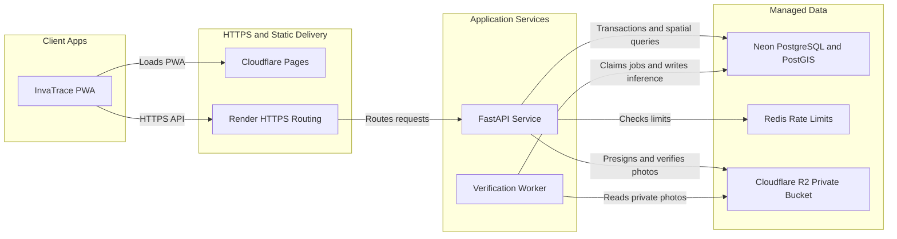
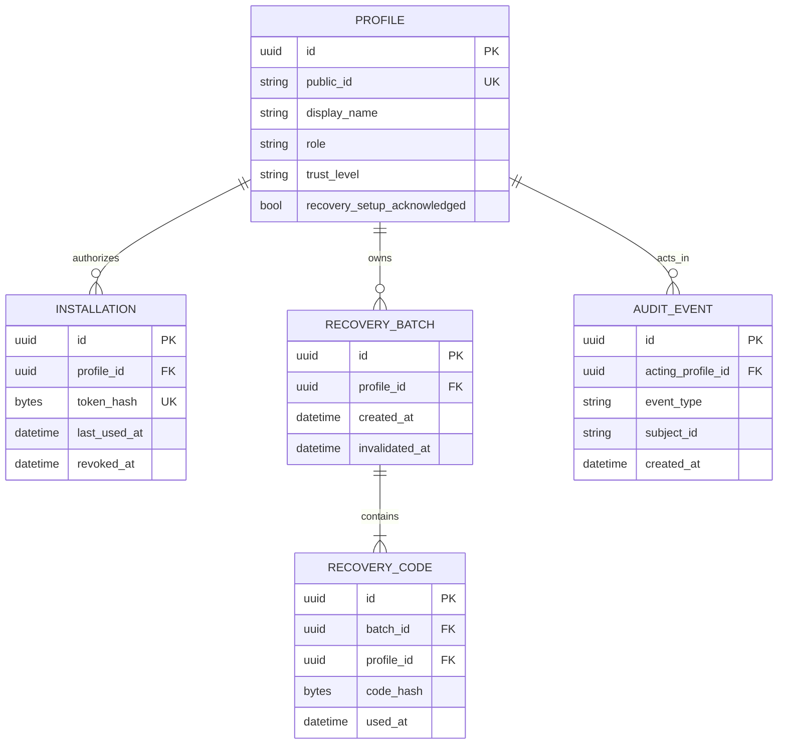
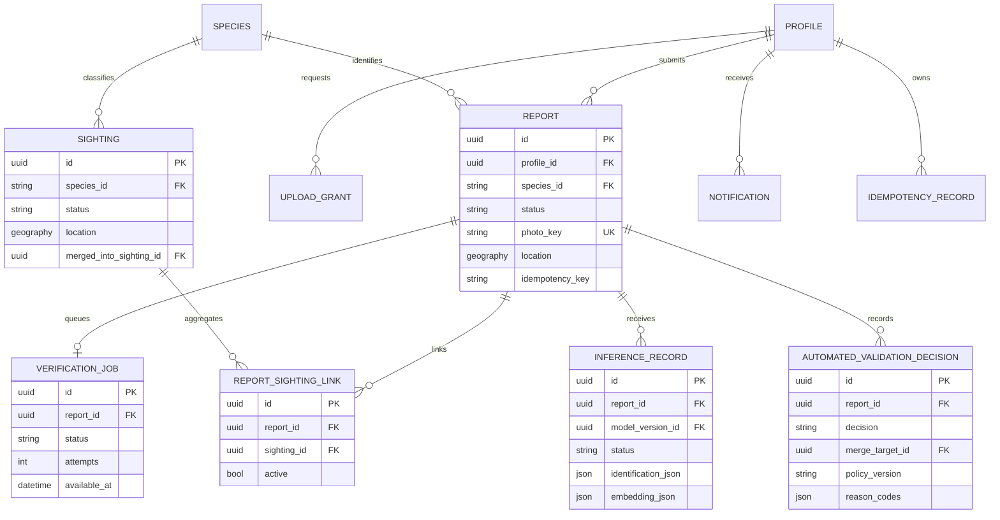
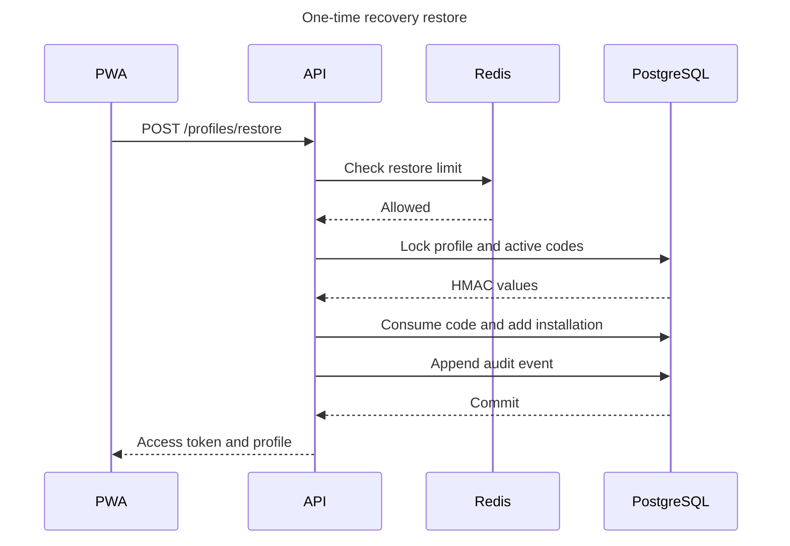
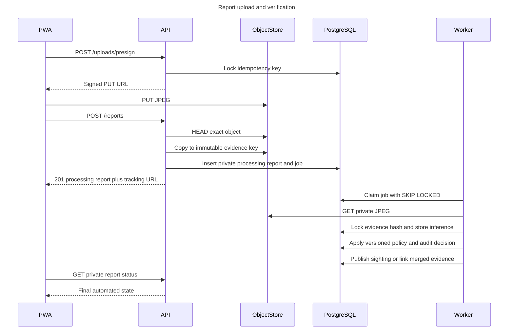

# Backend architecture and contracts

This implementation follows the Iteration 1 architecture: the installable PWA
is built by Vite and hosted on Cloudflare Pages; FastAPI and the verification
worker are independently deployable Render services; Neon provides
PostgreSQL/PostGIS; Cloudflare R2 provides private S3-compatible object storage.
Redis is the production rate-limit dependency. The browser ONNX adapter remains
client-side and is not moved into the API.

## Deployment topology

The Compose stack substitutes local PostGIS, Redis, and MinIO while preserving
the same protocols and process boundaries.

## Identity data model

## Reporting and verification data model

The migration contains the complete normalized schema, including monitored
areas/trails, model versions, OVC-VI stream events/checkpoints, and spatial GiST
indexes. The diagrams intentionally show the central bounded contexts rather
than every column.

## Private access restore sequence

Invalid profile IDs and recovery codes produce the same response. The raw code
is never stored, logged, or returned again.

## Idempotent report and automated validation sequence

## Public versus private validation visibility

Public sighting endpoints expose only confirmed and removed sightings. Reports
remain private while processing, when a rescan is needed, when rejected, and
when the server validator is unavailable. Coordinates contributed by `New`
profiles are deterministically displaced by about 100 metres and rounded to
four decimal places.

Automated merging requires the independently identified same species, a nearby
confirmed sighting within at most 50 metres, and a model-embedding cosine match.
Exact image or capture replay is rejected. The worker serializes matching
content hashes and capture IDs before replay checks, then serializes each
server-identified species while checking spatial merge candidates.

## API error and cache contract

Errors use `{ code, detail, requestId }`. Validation failures are `400`, missing
or expired sessions are `401`, insufficient role is `403`, missing private
resources use non-enumerating `404` responses, conflicts use `409`, limits use
`429` plus `Retry-After`, and dependency failures use `503`.

Every response carries `X-Request-ID`, `X-Content-Type-Options: nosniff`, and
`Referrer-Policy: no-referrer`. Identity and authenticated responses carry
`Cache-Control: private, no-store` and `Pragma: no-cache`. Production responses
include HSTS; CORS origins are explicit and the wildcard is rejected at startup.
