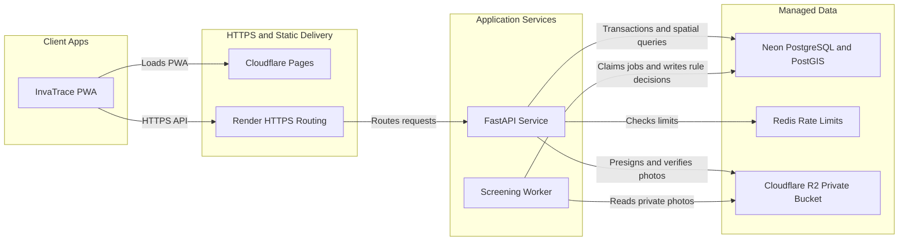
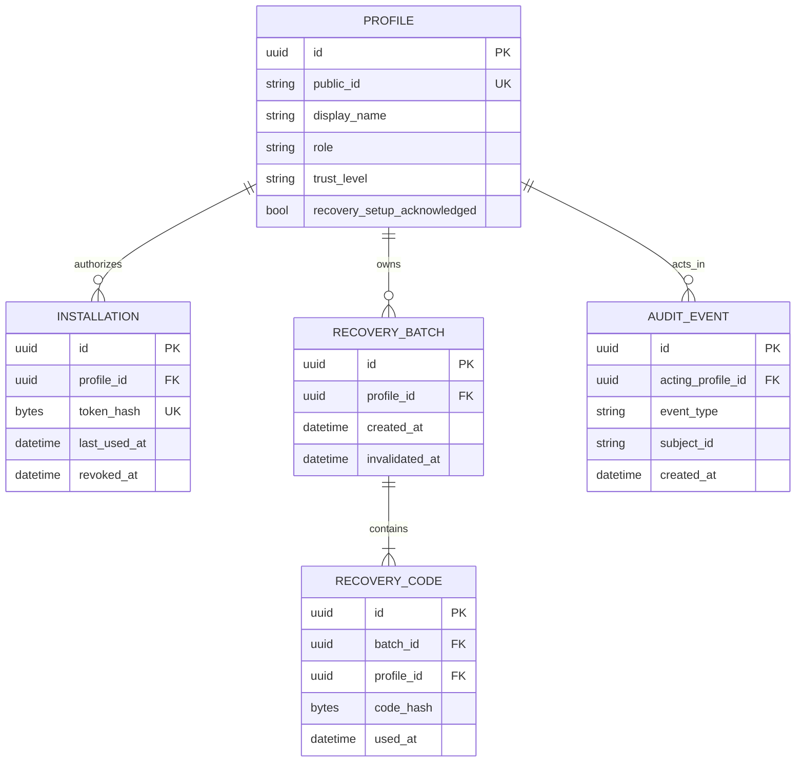
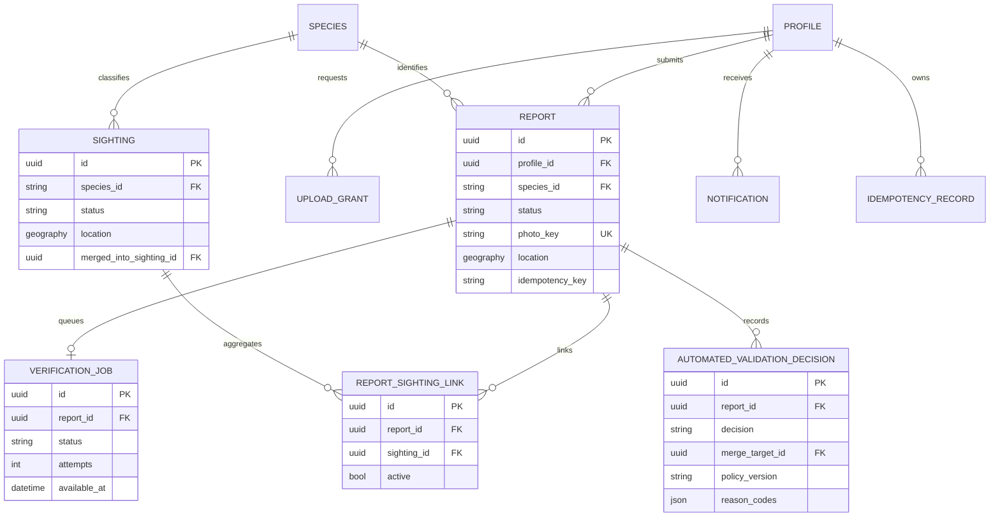
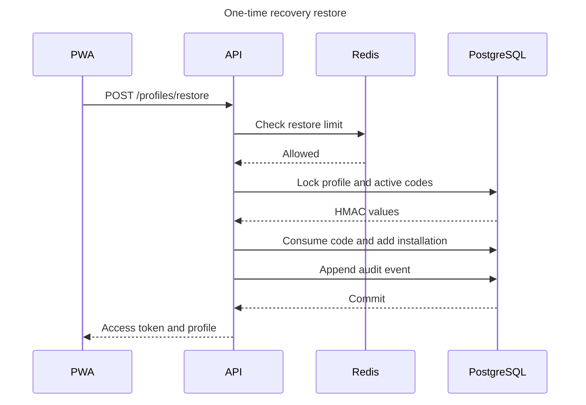
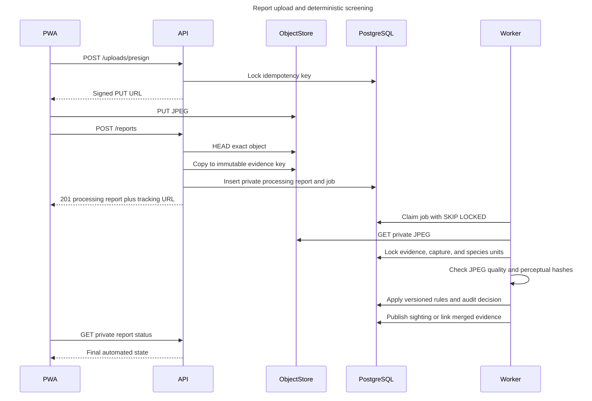

# Backend architecture and contracts

This implementation follows the Iteration 1 architecture: the installable PWA
is built by Vite and hosted on Cloudflare Pages; FastAPI and the verification
screening worker are independently deployable Render services; Neon provides
PostgreSQL/PostGIS; Cloudflare R2 provides private S3-compatible object storage.
Redis is the production rate-limit dependency. The browser ONNX adapter remains
client-side and is not moved into the API.

## Deployment topology

The Compose stack substitutes local PostGIS, Redis, and MinIO while preserving
the same protocols and process boundaries.

## Identity data model

## Reporting and screening data model

The migration contains the complete normalized schema, including monitored
areas/trails, legacy research tables, OVC-VI stream events/checkpoints, and spatial GiST
indexes. The diagrams intentionally show the central bounded contexts rather
than every column.

## Private access restore sequence

Invalid profile IDs and recovery codes produce the same response. The raw code
is never stored, logged, or returned again.

## Idempotent report and automated screening sequence

## Public versus private screening visibility

Public sighting endpoints expose only rule-screened and removed sightings. Reports
remain private while processing, when a rescan is needed, when rejected, and
when required screening dependencies are unavailable. Coordinates contributed by `New`
profiles are deterministically displaced by about 100 metres and rounded to
four decimal places.

Exact byte or capture-ID replay is rejected. A multi-view difference hash also
detects resized images and common 80 percent crops. Reports that pass image
size, exposure, contrast, edge-detail, GPS, supported E1 version, and duplicate
rules are published with status `screened`. A report is merged when the same E1
species has a rule-screened sighting within the configured distance and time
window. The worker serializes matching content hashes, capture IDs, species,
and the bounded cross-species perceptual replay comparison before accepting a
candidate, so relabelling or racing a reused photo does not bypass the rule.

These rules do not determine whether a photo was taken from a screen or print,
and they do not detect sophisticated edits. The API explicitly returns
`authenticityAssessed: false`; authenticity classification is deferred to a
later iteration.

## API error and cache contract

Errors use `{ code, detail, requestId }`. Request validation failures are `400`, missing
or expired sessions are `401`, insufficient role is `403`, missing private
resources use non-enumerating `404` responses, conflicts use `409`, limits use
`429` plus `Retry-After`, and dependency failures use `503`.

Every response carries `X-Request-ID`, `X-Content-Type-Options: nosniff`, and
`Referrer-Policy: no-referrer`. Identity and authenticated responses carry
`Cache-Control: private, no-store` and `Pragma: no-cache`. Production responses
include HSTS; CORS origins are explicit and the wildcard is rejected at startup.
